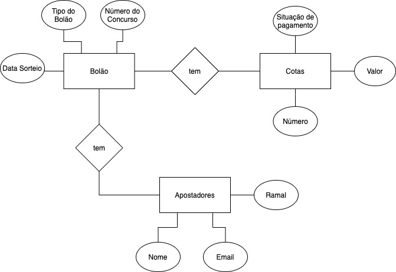

## Problematica

Jairo trabalha no Departamento de Informática de uma grande empresa. Ele e seus amigos estão sempre fazendo bolão da MegaSena, Quina e outros tipos de jogos.

Jairo sempre controla numa planilha Excel os números apostados, além das pessoas que entraram no bolão, seus e-mails (para receberem os números apostados) e se pagaram suas cotas.

Entretanto, isso tem lhe tomado um tempo considerável. Sendo assim, ele pensou em desenvolver uma aplicação que atenda às seguintes funcionalidades:

- permita cadastrar os participantes de cada bolão, com seus ramais e e-mails;

- para cada bolão feito, cadastrar o valor da cota, número de cotas, os cartões apostados (com sua relação de números), o tipo de jogo (MegaSena, Quina etc.), o número do concurso e a data em que será realizado o sorteio;

- controlar quem pagou cada cota;

- gerar automaticamente uma página Web com os dados do sorteio, participantes do bolão com suas cotas e os números apostados. O arquivo HTML dessa página será enviada por e-mail;

- cada participante poderá adquirir mais de uma cota;

- gerar a lista de participantes que ainda não pagaram;

- a aplicação deve verificar se o total das cotas é igual ao total apostado;

- uma determinada aposta pode ser aproveitada em outros bolões.

---

**Entregáveis:**

**Desenvolvimento de uma aplicação (Web, Mobile, Desktop)**

1. Modelo conceitual dos dados (MER).
   <!-- TODO: Rever o modelo conceitual -->

   
   modelo feito com uso da ferramenta [draw.oi](https://desk.draw.io)

2. Estimativa NESMA em pontos de função. (PF=35 _ ALI + 15 _ AIE)

- Arquivo Lógico Interno (ALI) – é um grupo lógico de dados ou informações de controle sob o ponto de vista do usuário, cuja manutenção é feita pela aplicação (ANDRADE, 2004, p. 14). São exemplos de ALI, tabelas de banco de dados e arquivos de configurações mantidos na fronteira da aplicação;

- Arquivo de Interface Externa (AIE) – é um grupo lógico de dados referenciado na aplicação cuja responsabilidade pela manutenção é de outra aplicação (ANDRADE, 2004, p. 14). Assim, um AIE não é mantido pela aplicação que está sendo contada, é apenas referenciado. Um AIE é na realidade um ALI de outra aplicação.

  No sistema foi detectado 3 ALI e 0 AIE nesse inicio de analise.

  ALI = 3
  AIE = 0

  ***

  PF = 35 _ 3 + 15 _ 0 = 105

3. Relação dos requisitos com descrição simplificada.
   Os Requisitos de um sistema são as descrições do que o sistema deve fazer, os serviços que oferece e as restrições ao seu funcionamento.

- Requisitos do Usuários.

  1. O sistema de bolão deve gerar um relatório com os números apostados e os participantes do bolão, identificados com seus ramais e email e deve identificar com clareza os participantes que pagaram as cotas.

- Requisitos Funcionais.

  1. O Sistema possibilitará o cadastro de Usuário pelos campos de **input** de _email_ e seu _ramal_ e que devem ser únicos.

  2. O Sistema cadastrará o valor da cota, junto aos campos de **input** dos _números de cotas_, os _números apostados_ e o _tipo de Bolão_, o _número do concurso_ como a _data_ que ocorrerá o sorteio.

  3. O Sistema terá um controle fino e gerará um **output** relatório de quem pagou os bolões.

  4. O sistema disponibilizará um **output** dos registro dos dados de sorteios, cotas, número apostado e tipos de bolões.

  5. O sistema enviará email para os usuários com os dados referentes a suas apostas

- Requisito não Funcional

  1. O sistema armazenará dados das apostas dos bolões e poderá usar para eventuais análises futuras como também uso indiscriminado das mesmas.

  2. O sistema terá o controle em forma de relatório dos usuários que pagaram os bolões.

  3. O sistema não terá vinculo com alguma forma de pagamento.

  4. O sistema terá que ser usual e de fácil compreensão, para que administra como também seus eventuais apostadores.

  5. O sistema deve manter-se no ar 24/7. Havendo queda desse serviço ele deve-se alto gerenciar usando as politicas de auto gerenciamento junto com prevenção de falhas.

  6. O sistema deve manter sua escalabilidade nos momentos de pico.

4. História de Usuários.

   Como um **apostador**
   Eu quero ver os **bolões** disponíveis.

   Para **apostar** ou associar a cotas
   O **apostador** para encontrar o bolão desejado deve informar o nome do bolão.
   O **sistema** deve informa as cotas para cada bolão associado.
   O **apostador** fará escolha da sua aposta escolhendo os números e pagando sua cota ou cartão.
   O **sistema** so aceitará participação do **apostador** mediante sua confirmação de pagamento.

   ***

   Como um **administrador**
   Eu quero ver ou listar os _apostadores_ que fizeram suas apostas e pagaram.

   Para **administrar** o fluxo de apostas
   O **administrador** listará as cotas dos bolões
   O **sistema** deve informa a data que ocorrera esse bolões.
   O **administrador** selecionando o bolão em questão pode ver os apostadores participantes desse bolão.
   O **sistema** informará os números sorteados para cada bolão.

   ***

5. Persona primária.

   
   persona desenvolvida com uso da ferramenta [**Xtensio**](https://app.xtensio.com/design/w04t0200)

6. MVP para o produto "conceito da aplicação".(Minimal viable product)

   O Bolão da galera, e app onde se concentra apostadores fanáticos que não perdem uma boa aposta, sempre com intuito de gerar lucro para seus usuários o Bolão da Galera passa credibilidade e confiança aos seus colaboradores gerando uma ligação baseada em números, longa e duradoura.

   O bolão consiste em usuários organizados selecionando o tipo de bolão, sendo os principais dele a mega-sena e quina, onde é disponibilizadas cotas e números pra realização de suas apostas juntamente com a data que ocorrera o sorteio.

   O Bolão também disponibilizara de relatórios para gerenciar os apostadores que pagaram como também as cotas que foram sorteadas.
